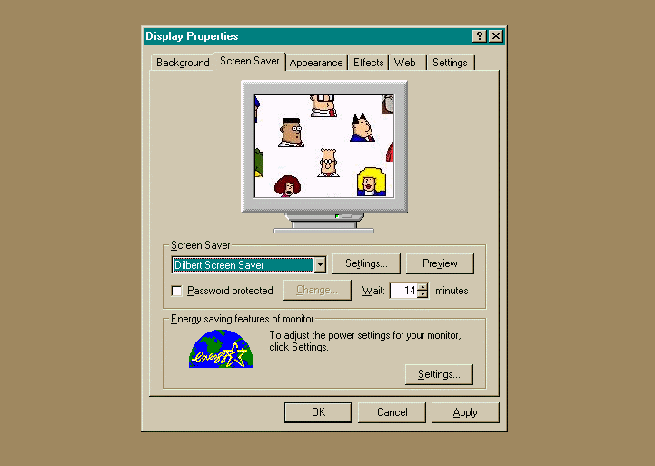



## Dilbert on\-line screen saver

### Description

OK, I'll kick off by echoing what many will be saying... "Oh no - not another screen saver!". But bear with me, and I'll give some reasons why I think you may find this submission worth examining, especially if you're intending to write their own screen saver application....

1) It's on-line!

Instead of those image gallery type screen savers that just display a selection of images you already have on your hard-disk, this application goes further - it accesses the internet to bring you a new Dilbert cartoon every day! It does this by accessing the Dilbert website and parsing the HTML content of the monthly cartoon archive.

So the longer you use the screen saver, the larger your own cartoon collection becomes!

Worried about bandwidth? Fear not, because the application will only try to update it's local cartoon archive once each day, and can be configured to only try to do this within certain daily time ranges, so it doesn't end up costing you money if you have restricted internet access (such as FreeServe HomeTime).

2) It's big on features!

This implementation contains commented code which demonstrates how to implement a fully-functioning screen saver, including a preview window and settings dialog which are integrated properly to the Display Properties dialog.

It also has code which ensures it works equally well with all screen resolutions and colour depths - using this project as a template will help you go some way to making a screen saver which disappoints few users, regardless of how they configure their display.

3) It compiles (relatively) small!

Despite the fact that the in-built settings dialog has colour picking functionality, and the saver scrapes HTML content from the web, the Common Control and Internet Transfer Control are not used. To keep the size down, WIN32 API calls are made, and this functionality is useful for anyone wishing to compile a resource-frugal application.

4) It looks good!

It can be configured to display the cartoon gallery against either a blank backdrop, or superimposed over the desktop contents, and can use the alpha-blending functionality of the Microsoft Imaging component (msimg32.dll) to 'dim' the backdrop.

5) It's bug free!

Ok, don't hold me to this. But it does plenty of checks to ensure that multiple running instances are prevented, and that it ensures that preview window and settings dialogs automatically close when the Display Properties dialog does. It may not sound that big a deal, but it's there little touches that make the implementation complete.

6) It's a good template project!

Not a big fan of Dilbert? Well, it could easily be modified to access other image archives. The functionality included here is the basic requirement for a professional looking gallery screen saver.

Well that's enough of that.... Give it a go if it sounds useful.
 
### More Info
 

             |
---                |---
**Submitted On**   |2003-12-02 13:55:30
**By**             |[Paul E Collingwood](https://github.com/Planet-Source-Code/PSCIndex/blob/master/ByAuthor/paul-e-collingwood.md)
**Level**          |Intermediate
**User Rating**    |5.0 (65 globes from 13 users)
**Compatibility**  |VB 5\.0, VB 6\.0
**Category**       |[Complete Applications](https://github.com/Planet-Source-Code/PSCIndex/blob/master/ByCategory/complete-applications__1-27.md)
**World**          |[Visual Basic](https://github.com/Planet-Source-Code/PSCIndex/blob/master/ByWorld/visual-basic.md)
**Archive File**   |[Dilbert\_on1679321222003\.zip](https://github.com/Planet-Source-Code/paul-e-collingwood-dilbert-on-line-screen-saver__1-50271/archive/master.zip)

